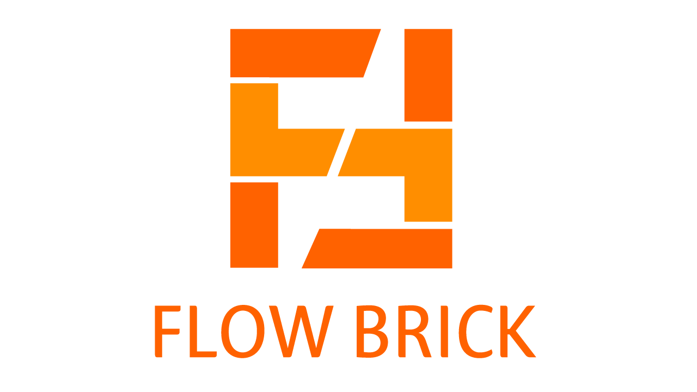

# FlowBrick

   
  
   

목차

## 프로젝트 소개

### PMS(Project Management System)시스템 구현

 
  - 현업에서 많이사용하는 프로그램의 흐름과 개요를 최대한 자세하게 구현함 
  - 프로젝트관리, 캘린더, 일정기능을 비롯하여 공지사항, 채팅기능 부가적인 요소들도 구현

 

## 기술 스택

| JavaScript | JAVA       |  Html    |  CSS   |  Oracle   |  SpringBoot   |
| :--------: | :--------: | :------: | :-----: |:-----: |:-----: |
|   ![js]    |     | ![html] | ![css] |  | ![spring] |

 

## 팀원 및 담 기능

### 이준호
####  -프로젝트 등록, 캘린더, 칸반보드

### 문해인
#### 로그인, 회원관리, 부서관리, 채팅

### 박성중 [@psj1561](https://github.com/psj1561)
#### 대시보드(메인화면), 공지사항, 파일 업로드/다운로드, 프로젝트 결재

### 장선웅
#### 프로젝트 수정/삭제, 자원관리, 간트차트

 

## 배운 점 & 아쉬운 점

 이 프로젝트를 진행하면서, 실제 현업에서 사용되는 시스템을 직접 구현해보는 경험은 매우 유익했습니다. Spring Boot와 JSP를 활용한 이번 프로젝트는 단순히 프로그래밍 실력을 향상시키는 것을 넘어, 소프트웨어 개발에서 중요한 시스템의 흐름과 구조를 이해하는 데 큰 도움이 되었습니다.

 또한 Java, JavaScript, Spring Boot, JSP와 같은 다양한 기술 스택을 사용해 개발을 진행하면서, 각각의 기술이 어떻게 유기적으로 연결되고, 이를 통해 최종적으로 완성도 높은 웹 애플리케이션을 만들어낼 수 있는지를 체험했습니다.

 마지막으로 이번 프로젝트를 통해 협업의 중요성을 다시 한번 실감했습니다. 시스템을 개발하면서 발생한 다양한 문제들을 해결하는 과정에서 팀장을 맡으며, 팀원들과의 소통과 협력이 얼마나 중요한지를 깨달았습니다. 결과적으로 Flow Brick 프로젝트는 기술적 역량뿐만 아니라, 실무에서 필요한 여러 가지 능력들을 종합적으로 키울 수 있었던 소중한 경험이 되었습니다.

 

## 라이센스 및 인용

### -MIT &copy; [NoHack](mailto:lbjp114@gmail.com) 
### -사이트디자인: BootStrap5 https://www.w3schools.com/bootstrap5/index.php

<!-- Stack Icon Refernces -->

[js]: /images/stack/javascript.svg
[ts]: /images/stack/typescript.svg
[react]: /images/stack/react.svg
[node]: /images/stack/node.svg
[css]: /images/stack/css.svg
[html]: /images/stack/html.svg
[java]: /images/stack/java.png 
[oracle]: /images/stack/oracle.png
[spring]: /images/stack/spring-96.svg
